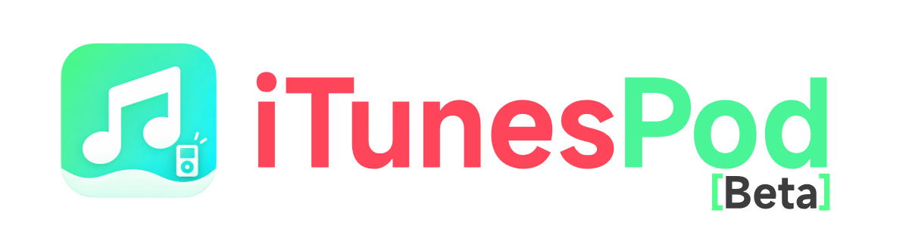

<div align="center">
  
  <br />
  

  <h1>iTunesPod</h1>
  <p><strong>经典 iPod 的本地音乐管理与同步工具</strong></p>

  <p>
    <a href="https://github.com/LeiDellTech/iTunesPod/stargazers"></a>
    <a href="https://github.com/LeiDellTech/iTunesPod/network/members"></a>
    <a href="https://github.com/LeiDellTech/iTunesPod/issues"></a>
    <a href="LICENSE"></a>
    
    
  </p>

  <p>
    <a href="#快速开始">快速开始</a> ·
    <a href="#功能一览">功能一览</a> ·
    <a href="#设备兼容性">设备兼容性</a> ·
    <a href="#安全与隐私">安全与隐私</a> ·
    <a href="#参与项目">参与项目</a>
  </p>
</div>

**iTunesPod** 是一款面向 Windows 的本地音乐资料库和 iPod 管理器。它把音乐整理、播放列表、播客、封面、备份与设备同步放在同一个桌面应用中。项目使用 **C#、.NET 8、WPF**，界面提供统一、简洁的桌面体验。

> 当前版本重点验证 **iPod nano 第 4 代**。只有通过设备型号、数据库版本和签名检查的设备才开放写入；其他型号不会因为“看起来兼容”就被尝试写入。

## 快速开始

### 安装

从 [GitHub Releases](https://github.com/LeiDellTech/iTunesPod/releases) 下载 **iTunesPod 0.4.0 Beta** Windows x64 安装程序。安装程序包含 .NET Desktop Runtime 与所需媒体工具，无需单独安装运行环境；发布页同时提供 SHA-256 校验文件。

当前版本处于 Beta 阶段，安装程序尚未进行 Authenticode 签名。首次使用设备同步前请备份 iPod；不要在未验证的型号上尝试写入。

### 从源码构建

需要 Windows、.NET 8 SDK。克隆仓库后运行：

```powershell
git clone https://github.com/LeiDellTech/iTunesPod.git
cd iTunesPod
dotnet restore iTunesPod.sln
dotnet build iTunesPod.sln -c Release
dotnet test iTunesPod.sln -c Release
```

本地运行 WPF 应用：

```powershell
dotnet run --project src/iTunesPod.App -c Release
```

自包含发布目录：

```powershell
dotnet publish src/iTunesPod.App -c Release -r win-x64 --self-contained true -o artifacts/win-x64-wpf
```

如需 Inno Setup 安装包，安装 Inno Setup 6 后运行 `./build.ps1 installer`。

## 功能一览

| 区域 | 能力 |
|---|---|
| 本地资料库 | 导入文件、文件夹或拖放；读取标签与内嵌封面；重复内容识别；搜索、艺术家、专辑与最近添加 |
| 播放与整理 | 音乐播放、队列、播放进度、播放列表、M3U/M3U8 和智能播放列表 |
| 元数据编辑 | 编辑标签、评分与封面；在保存源文件前创建备份 |
| 播客 | RSS 订阅、刷新、下载、取消和保留策略 |
| iPod 管理 | 设备识别、容量与曲目浏览、播放列表、封面、播放统计、照片、备忘录与安全弹出 |
| 同步与恢复 | 变更预览、兼容性检查、容量估算、内容去重、分阶段事务、提交后复读校验与失败恢复 |
| 备份 | 元数据快照或完整备份；断点续传、逐文件校验与恢复前备份 |
| 体验 | 简繁中文、深浅主题、MiSans（系统已安装时）、预载和应用内统一风格窗口 |

## 设备兼容性

| 设备 | 识别/读取 | 写入 | 状态 |
|---|---:|---:|---|
| iPod nano 第 4 代 | 是 | 是 | 数据库版本 115 / HASH58 校验；完成过真实设备写入、复读与恢复验证 |
| 其他 iPod 型号 | 视型号及数据库而定 | 否 | 未完成设备专项认证时，写入器会拒绝操作 |

设备支持会以实际验证为准。数据库写入能力来自该设备的协议、固件和文件系统组合；相似型号或相同系列不代表可以共用写入配置。

### Nano 4 的写入保护

提交前，应用会重新检查设备身份、挂载会话、数据库代次和相关文件哈希，并生成恢复备份。写入期间记录事务日志；提交后重新读取数据库并验证签名。发生错误时会尝试恢复原数据库和清理本次新增媒体。遇到外部修改或无法确认的状态时，程序会停止自动覆盖并保留恢复信息。

首次使用前请备份设备。请在系统确认设备写入和验证完成后再安全弹出。真实固件播放、显示效果、突然拔线或断电等情形仍需要逐台实机验收。

## 安全与隐私

- 音乐资料库、播放记录、设备缓存和任务日志默认保存在本机 `%LOCALAPPDATA%\iTunesPod`。
- 应用没有遥测；RSS 和封面只会在用户主动操作时联网。音乐文件不会被上传到本项目的服务器。
- 仓库不接受个人音乐库、设备数据库、序列号、备份、日志、签名密钥或本地构建产物。
- `.gitignore` 已屏蔽验证输出和内部规划文档。提交前仍请检查 `git status` 和变更内容，确保没有误加个人文件。
- 发现安全问题，请使用 GitHub 的 [Private vulnerability reporting](https://github.com/LeiDellTech/iTunesPod/security/advisories/new) 私下联系维护者，不要在公开 Issue 中贴设备数据或日志。

## 开源与鸣谢

主项目采用 [MIT License](LICENSE)。项目也使用 NAudio、TagLibSharp、Microsoft.Data.Sqlite、SQLitePCLRaw、WPF 和 FFmpeg 等组件；各组件的许可证、版本与分发说明见 [THIRD-PARTY-NOTICES.md](THIRD-PARTY-NOTICES.md)。

设备识别表和部分协议研究参考了 [iOpenPod](https://github.com/TheRealSavi/iOpenPod)，相关 MIT 声明保留在仓库中。iPod 产品图仅用于设备识别，来源和说明见 [图片来源说明](src/iTunesPod.App/Assets/Devices/SOURCES.md)。MiSans 字体按小米许可使用；字体文件不包含在项目中。

iTunesPod 是独立第三方项目，与 Apple 无隶属或官方认可关系。iPod 是 Apple Inc. 的商标。

## 参与项目

欢迎提交缺陷报告、体验反馈、文档改进和经过验证的设备兼容性资料。请先阅读 [贡献指南](CONTRIBUTING.md)。提交设备资料时请删除序列号、用户音乐信息和个人路径；不要上传未经授权的数据库或固件内容。

在真实设备上验证新的写入配置前，请提供可重复的测试步骤、测试设备与固件信息、测试前后哈希和恢复验证结果。新型号不会因为一次成功启动或一次数据库解析就被标记为可写。

## 路线图

- [ ] 持续完善资料库、同步预览与错误恢复体验
- [ ] 增加自动构建和发布流程
- [ ] 在获得设备并完成往返验证后，逐个扩展可写型号
- [ ] 收集脱敏的用户体验反馈，完善高 DPI 与辅助功能

路线图表示计划，不代表功能已经完成。

## English

iTunesPod is a local-first music library and iPod manager for Windows, built with C#, .NET 8 and WPF. It brings library management, playback, playlists, podcasts, artwork, backups and device sync into one desktop app.

**Validated write support is currently limited to iPod nano (4th generation).** Other models remain read-only or experimental until their exact hardware, database and firmware combination has been independently validated. The writer checks device identity and database signatures, creates a recovery backup, verifies committed data and stops when external changes make recovery uncertain.

See the sections above for [installation and build instructions](#快速开始), the [feature list](#功能一览), [device compatibility](#设备兼容性), and [privacy and security](#安全与隐私). Contributions are welcome; please read [CONTRIBUTING.md](CONTRIBUTING.md) first.

---

<div align="center">
  <sub>Made for the music you already own · © WatchGeek表极客</sub>
</div>
